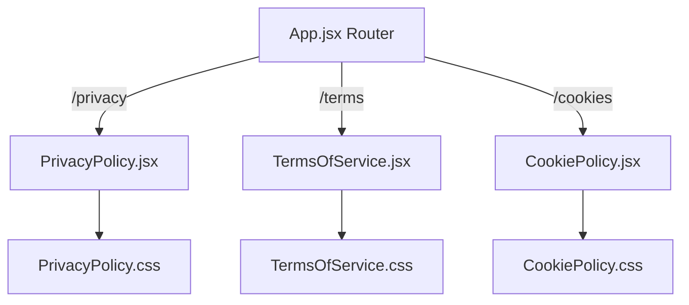

# Design Document: Legal Pages

## Overview

Three standalone legal pages — Privacy Policy (`/privacy`), Terms of Service (`/terms`), and Cookie Policy (`/cookies`) — for the BrightCode platform. Each page is a React JSX component with a scoped CSS file, registered as a public route in `client/src/App.jsx`, and styled to match BrightCode's dark premium aesthetic using global CSS variables, framer-motion entry animations, and a back navigation button.

The pages contain detailed, legally appropriate content specific to BrightCode's actual features: XP system, arcade challenges, leaderboard, factions, localStorage-based progress persistence, and JWT authentication.

## Architecture

All three pages follow the same structural pattern already established by `Docs.jsx` and `Settings.jsx`:

```
client/src/pages/
  PrivacyPolicy.jsx      ← new
  PrivacyPolicy.css      ← new
  TermsOfService.jsx     ← new
  TermsOfService.css     ← new
  CookiePolicy.jsx       ← new
  CookiePolicy.css       ← new

client/src/App.jsx       ← add 3 public routes
```

Routes are added as plain `<Route>` elements (no `ProtectedRoute` wrapper), identical to the existing `/leaderboard` route pattern.



## Components and Interfaces

### Shared Component Pattern

Each legal page component follows this interface:

```jsx
// Props: none (standalone page)
// Dependencies: framer-motion, lucide-react, react-router-dom
// CSS: scoped stylesheet imported locally

const LegalPage = () => {
  const navigate = useNavigate();
  return (
    <div className="legal-page">
      {/* Back nav */}
      <nav className="legal-nav">
        <button className="back-btn" onClick={() => navigate(-1)}>
          <ArrowLeft size={20} /> Back
        </button>
      </nav>
      {/* Animated content */}
      <motion.div
        initial={{ opacity: 0, y: 20 }}
        animate={{ opacity: 1, y: 0 }}
        transition={{ duration: 0.5 }}
        className="legal-container"
      >
        {/* Header with icon, title, effective date */}
        {/* Sections */}
      </motion.div>
    </div>
  );
};
```

### Back Navigation

`navigate(-1)` is used (not `navigate('/')`) so the user returns to whichever page they came from — consistent with the requirement that the router navigates to the previous page in browser history.

### Lucide Icons Used

- `PrivacyPolicy.jsx` — `Shield`, `ArrowLeft`
- `TermsOfService.jsx` — `FileText`, `ArrowLeft`
- `CookiePolicy.jsx` — `Cookie`, `ArrowLeft`

## Data Models

No dynamic data. All content is static JSX. The effective date is hardcoded as a string constant at the top of each component file for easy future updates:

```js
const EFFECTIVE_DATE = 'July 1, 2025';
```

## Error Handling

These are static pages with no API calls, no async operations, and no user input. Error handling is not applicable beyond the existing global `ErrorBoundary` already wrapping the entire app in `App.jsx`.

## Testing Strategy

PBT assessment: This feature consists entirely of static legal content pages. All acceptance criteria are content presence checks, routing checks, or specific UI interaction checks. None involve universal properties that vary meaningfully with input. **Property-based testing does not apply.**

Testing approach:

- **Example-based unit tests** (using Vitest + React Testing Library):
  - Each component renders without crashing
  - Back button is present and calls `navigate(-1)` when clicked
  - Effective date is displayed
  - Required section headings are present in the rendered output
  - Components do not require authentication context to render

- **Routing tests**:
  - `/privacy`, `/terms`, `/cookies` routes exist in `App.jsx`
  - Routes are not wrapped in `ProtectedRoute`

- **Manual / visual tests**:
  - Responsive layout at 320px, 768px, 1440px
  - CSS variable usage (dark background, correct typography)
  - framer-motion entry animation plays on load
  - Back button navigates to previous page
